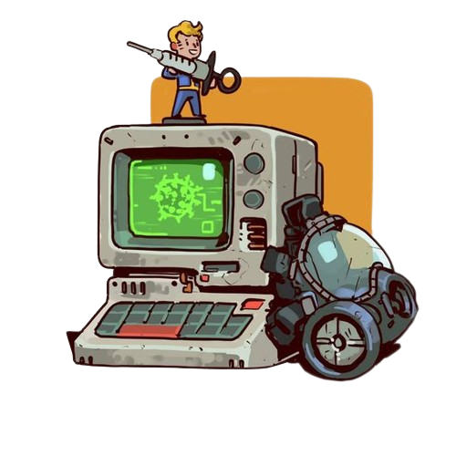

<!-- ###### HEAD ##### -->

  

   
  
  
  

  

 

<!-- ###### END OF HEAD ##### -->

<!-- ###### Languages | Tools ##### -->

 

<h4 align="center">
   
   
  Languages | Tools 
  
</h4>

<code></code>
<code></code>
<code></code>
<code></code>

<!-- ###### END OF Languages | Tools ##### -->

<!-- ###### Currently Learning ##### -->

<h4 align="left">
  📖 Currently Learning 📖 
</h4>

<code></code>
<code></code>
<code></code>

 

<!-- ###### END OF Currently Learning ##### -->

<!-- ###### Some of my projects ##### -->

  

    <h3> 🤖 Some of my projects </h3>
    
  

  
   

  

    
  

  

    
  

<!-- ###### END OF Some of my projects  ##### -->

<!-- ###### My Github Stats  ##### -->

<h4 align="center">
   
  My Github Stats 
  
</h4>
  
  
<!--<h6 align="center"> <b>Note:</b> Top languages is only a metric of the languages my public code consists of and doesn't reflect experience or skill level.</h6>-->

  
  
  

<!-- ###### END OF My Github Stats  ##### -->

<!-- ###### QUOTE OF THE DAY ##### -->

<h4 align="left">
<!-- Quote Of The Day --> Fun Fact Of The Day
</h4>

  

<!-- ###### END OF QUOTE OF THE DAY ##### -->

<!-- ###### SOCIAL MEDIA LINKS ##### -->

<h4 align="center">
   
  Contact 
  
</h4>

  
  
  
  

<!-- ###### END OF SOCIAL MEDIA LINKS ##### -->

<!-- ###### FOOTER ##### -->

<!-- ###### END OF FOOTER ##### -->
